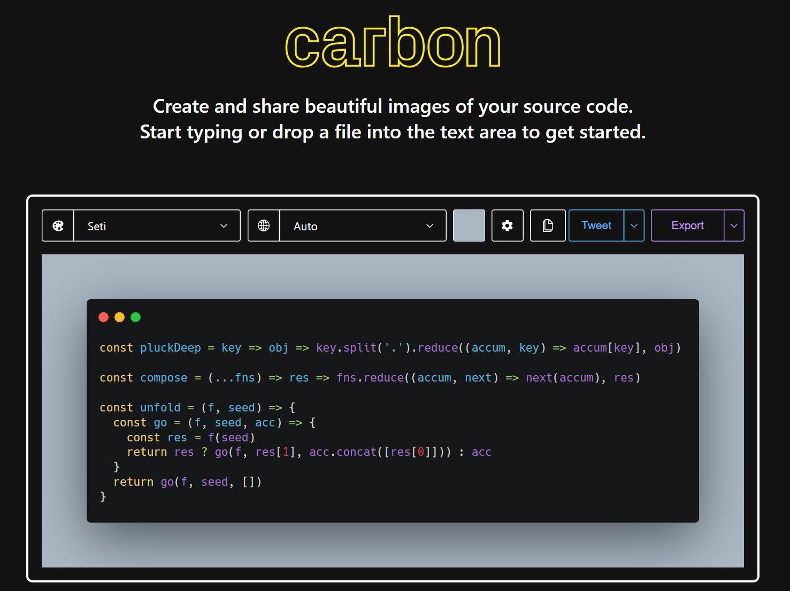
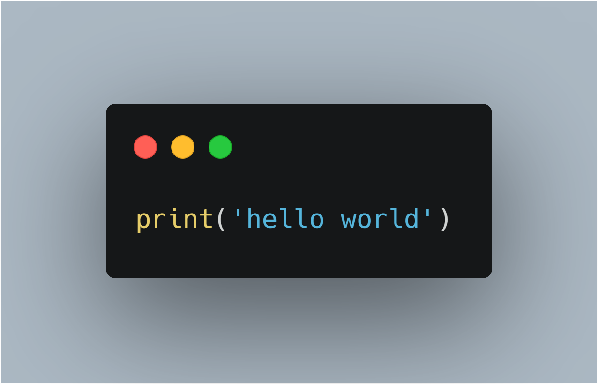

# PyCarbon

一个简单的`python`爬虫脚本，可以将你的代码通过`https://carbon.now.sh`网站的`API`导出成`PNG`，`SVG`格式。

## 官方主页



## Example

```python
print('hello world')
```

## Example to `PNG`



## Example to `SVG`


## `msedgedriver.exe`

[Microsoft Edge WebDriver](https://developer.microsoft.com/en-us/microsoft-edge/tools/webdriver/?form=MA13LH#downloads)
请根据浏览器版本号对应下载正确版本。
`msedgedriver.exe` `版本 126.0.2592.68 (正式版本) (64 位)`

## [py-carbon-clips](https://github.com/chavarera/py-carbon-clips)

思路起源于`py-carbon-clips`，相较于原项目的截屏方式我直接通过浏览器下载目标文件。
